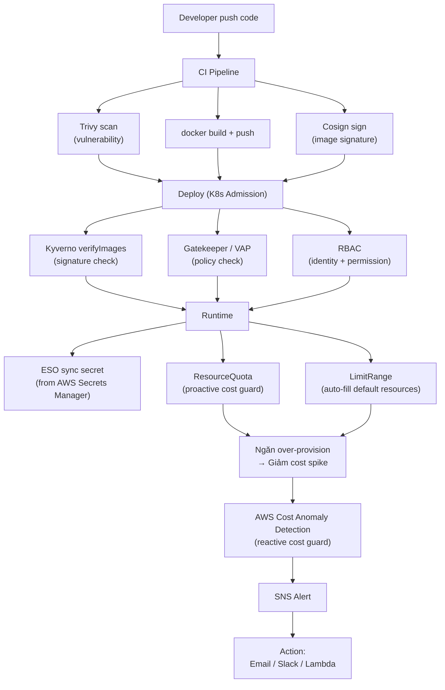

# Day-3 Study Plan: Platform Integration + Runbook + Cost Guard

**Thời lượng ước tính:** 3.5–4 giờ (tự học)
**Điều kiện tiên quyết:** Day-1 và Day-2 hoàn thành, K8s cluster đang chạy, Helm installed, Docker desktop đang chạy

---

## Section 1 — Tích hợp toàn stack W8→W10: Overview (30 phút)

### Mục tiêu
Hiểu cách các thành phần từ W8 (supply chain: Trivy + Cosign + Kyverno verifyImages) và W10 Day-1/2 (RBAC + Secrets + Admission policy) kết hợp thành một platform integration hoàn chỉnh. Sau section này bạn có thể vẽ được full flow từ code commit đến runtime.

### Thứ tự học

1. **Ôn nhanh các thành phần đã học:**
   - Day-1: `Role`, `RoleBinding`, `ClusterRole`, `ServiceAccount`, `kubectl auth can-i`, OPA Rego + Gatekeeper `ConstraintTemplate`/`Constraint`, ValidatingAdmissionPolicy (VAP)
   - Day-2: AWS Secrets Manager + External Secrets Operator (ESO) `ExternalSecret`/`SecretStore`/`ClusterSecretStore`, Trivy image scan, Cosign keyless + key-based signing, Kyverno `verifyImages`

2. **Đọc lại end-to-end flow đầy đủ:**
   ```
   Developer push code
       ↓
   CI Pipeline:
     ├── Trivy image scan (fail nếu CRITICAL/HIGH)
     ├── docker build + push
     └── Cosign sign (keyless OIDC) → attach signature
       ↓
   Deploy:
     ├── Kyverno verifyImages (admission webhook)
     │     ├── Image signed? → check Cosign signature
     │     └── Certificate identity match? → check OIDC issuer + subject
     ├── Gatekeeper / VAP (admission policy)
     │     ├── Chặn image :latest
     │     ├── Chặn privileged container
     │     └── Enforce resource rules
     └── RBAC: ai được deploy vào namespace nào
       ↓
   Runtime:
     ├── ESO sync secret từ AWS Secrets Manager → K8s Secret
     │     └── Pod mount secret → access credentials
     ├── ResourceQuota: giới hạn tổng namespace (cost guard)
     └── LimitRange: inject default requests/limits vào container
   ```

3. **Hiểu "Platform Integration" là gì:**
   - Không phải một tool đơn lẻ → là tổ hợp nhiều layers hoạt động cùng nhau
   - Mỗi layer giải quyết một vấn đề riêng, không overlap
   - **Security layer**: Kyverno + Gatekeeper/VAP → kiểm soát WHAT được deploy
   - **Identity layer**: RBAC → kiểm soát WHO được deploy
   - **Secret layer**: ESO + AWS Secrets Manager → kiểm soát HOW lấy credentials
   - **Resource layer**: ResourceQuota + LimitRange → kiểm soát HOW MUCH resource dùng
   - **Cost layer**: AWS Cost Anomaly Detection → kiểm soát HOW MUCH chi

### Check-point — tự hỏi mình trước khi qua Section 2

- [ ] Vẽ được full flow từ code commit đến runtime trên giấy?
- [ ] Mỗi layer giải quyết vấn đề gì? (Security / Identity / Secret / Resource / Cost)
- [ ] Tại sao cần cả Gatekeeper VÀ Kyverno verifyImages? Chúng khác gì nhau?
- [ ] ESO sync secret vào đâu trong flow? Pod đọc secret từ đâu?

---

## Section 2 — ResourceQuota + LimitRange: Lý thuyết (45 phút)

### Mục tiêu
Hiểu ResourceQuota (hard/soft limit namespace-wide) và LimitRange (default + range cho từng resource), phân biệt khi nào dùng cái nào, và cách chúng phối hợp với nhau.

### Thứ tự học

1. **Đọc tài liệu chính — ResourceQuota:**
   - URL: https://kubernetes.io/docs/concepts/policy/resource-quotas
   - Focus phần: "Hard and soft limits", "Requests vs limits", "Quota scopes"
   - Các loại quota:
     - `requests.cpu`, `requests.memory` — tổng requests của tất cả pods
     - `limits.cpu`, `limits.memory` — tổng limits của tất cả pods
     - `pods`, `services`, `secrets`, `configmaps`, `persistentvolumeclaims` — số lượng resources
   - Scope: **namespace-wide** — áp dụng cho tất cả pods trong namespace đó
   - `spec.scopeSelector`: chỉ áp dụng quota cho BestEffort pods hoặc NotBestEffort pods

2. **Đọc tài liệu chính — LimitRange:**
   - URL: https://kubernetes.io/docs/concepts/policy/limit-range
   - Focus phần: "Default requests and limits", "Limits"
   - 4 loại LimitRange (theo `spec.limits[].type`):
     - `Container` — áp dụng cho từng container
     - `Pod` — áp dụng cho tổng pod (sum tất cả containers)
     - `PersistentVolumeClaim` — áp dụng cho PVC
     - `PodCluster` — áp dụng cho tất cả namespaces trong cluster
   - Các field quan trọng:
     - `spec.default` — default **limit** nếu container không specify
     - `spec.defaultRequest` — default **request** nếu container không specify
     - `spec.max` — maximum request/limit cho container/pod
     - `spec.min` — minimum request cho container/pod
     - `spec.maxRatio` — ratio tối đa giữa limit và request

3. **Phân biệt khi nào dùng gì:**
   - **ResourceQuota:** Dùng khi cần giới hạn tổng namespace (team quota) → "Team A không được dùng quá 4 CPU / 8GB RAM"
   - **LimitRange:** Dùng khi cần enforce từng container phải có resources + inject default → "Container phải có requests >= 10m CPU, nếu không specify thì auto-fill"

4. **Phối hợp LimitRange + ResourceQuota:**
   ```
   LimitRange (namespace)
       ↓ auto-inject default nếu container không specify
   Container có requests/limits
       ↓
   ResourceQuota (namespace)
       ↓ sum tất cả requests/limits của tất cả containers
       ↓ check against hard limit
   Pass → Pod tạo được
   Fail → Pod bị reject (Fails for quota)
   ```

5. **Ghi nhớ:**
   - ResourceQuota và LimitRange đều là **namespace-scoped** (trừ PodCluster type)
   - ResourceQuota là **hard limit** — không thể vượt
   - LimitRange là **default + range** — có thể vượt nếu ResourceQuota cho phép
   - Cả hai đều nằm ở **admission phase** — được kiểm tra trước khi Pod tạo

### Check-point — tự hỏi mình trước khi qua Section 3

- [ ] ResourceQuota khác LimitRange ở điểm gì? (scope, mục đích)
- [ ] Nếu pod không specify `requests.cpu`, ai sẽ fill giá trị đó?
- [ ] LimitRange `default` và `defaultRequest` khác nhau ở đâu?
- [ ] ResourceQuota check trước hay LimitRange check trước?
- [ ] Tại sao cần cả hai thay vì chỉ dùng một?

---

## Section 3 — ResourceQuota + LimitRange: Lab (45 phút)

### Mục tiêu
Thực hành tạo LimitRange + ResourceQuota, test pod vi phạm, và fix để pass qua quota.

### Lab 1: Tạo namespace + LimitRange (default CPU/memory)

**Mục tiêu:** Tạo LimitRange inject default `requests` và `limits` cho containers không specify.

**Điều kiện tiên quyết:** K8s cluster đang chạy, `kubectl` config đúng context.

### Lab 2: Tạo ResourceQuota hard limit (namespace quota)

**Mục tiêu:** Tạo ResourceQuota giới hạn tổng CPU/memory + số lượng pods trong namespace.

**Điều kiện tiên quyết:** Hoàn thành Lab 1.

### Lab 3: Test pod auto-inject default (không specify resources)

**Mục tiêu:** Tạo pod không có `requests/limits` → xem LimitRange auto-fill giá trị mặc định.

**Điều kiện tiên quyết:** LimitRange đã tạo.

### Lab 4: Test pod bị reject vượt ResourceQuota

**Mục tiêu:** Tạo pod với requests/limits vượt ResourceQuota hard limit → bị reject.

**Điều kiện tiên quyết:** ResourceQuota đã tạo.

### Lab 5: Fix pod để pass qua quota

**Mục tiêu:** Điều chỉnh resources của pod để nằm trong ResourceQuota limit.

**Điều kiện tiên quyết:** Hoàn thành Lab 4.

---

## Section 4 — Chaos Engineering: Lý thuyết (45 phút)

### Mục tiêu
Hiểu Chaos Engineering là gì, Litmus vs Chaos Mesh, các loại chaos experiment, và cấu trúc runbook template cho incident response.

### Thứ tự học

1. **Chaos Engineering — Tổng quan:**
   - Đọc: https://principlesofchaos.org/ (Principles of Chaos Engineering)
   - Định nghĩa: "deliberately inject failure vào production-like environment để build confidence vào hệ thống"
   - Vấn đề giải quyết: tìm weak point **trước khi** production fail, không phải sau khi
   - Workflow cốt lõi:
     ```
     Xây steady-state hypothesis → Inject failure → Observe → Learn → Fix
     ```
   - 4 advanced principles: Build hypothesis around steady-state, Vary real-world events, Run in production, Minimize blast radius

2. **Litmus Chaos:**
   - URL: https://litmuschaos.io
   - Docs: https://docs.litmuschaos.io/docs/
   - Kiến trúc:
     ```
     ChaosOperator (controller)  → quản lý experiments
         ↓
     ChaosEngine (CRD)          → define experiment config
         ↓
     ChaosExperiment (CRD)      → actual chaos logic
         ↓
     ChaosResult (CRD)          → lưu kết quả (pass/fail + events)
     ```
   - Các loại experiment phổ biến:
     - `pod-delete` — xóa pod ngẫu nhiên
     - `pod-cpu-hog` — tạo CPU stress
     - `pod-memory-hog` — tạo memory stress
     - `network-latency` — thêm latency vào network
     - `network-loss` — drop packets
     - `disk-fill` — fill disk space
     - `container-kill` — kill container cụ thể

3. **Chaos Mesh:**
   - URL: https://chaos-mesh.org
   - Docs: https://chaos-mesh.org/docs/
   - Kiến trúc:
     ```
     ChaosController (controller manager)  → quản lý chaos resources
         ↓
     ChaosDaemon (agent trên mỗi node)    → thực thi chaos trên node
         ↓
     Sidecar DNS                           → DNS chaos (nếu dùng)
     ```
   - Các loại chaos (CRDs):
     - `PodChaos` — pod failure (delete, kill, container kill)
     - `NetworkChaos` — network failure (latency, loss, partition, duplicate)
     - `IOChaos` — I/O failure (delay, error, fault)
     - `StressChaos` — CPU/memory stress
     - `DNSChaos` — DNS failure (random, target domain)
     - `HTTPChaos` — HTTP failure (delay, patch, abort)
     - `TimeChaos` — time skew
     - `KernelChaos` — kernel panic/injection

4. **So sánh Litmus vs Chaos Mesh:**

   | Tiêu chí | Litmus Chaos | Chaos Mesh |
   |---|---|---|
   | Kiến trúc | Operator + ChaosEngine | Controller + ChaosDaemon |
   | Cài đặt | Helm | Helm |
   | Multi-cloud | ✅ (K8s bất kỳ) | ✅ (K8s bất kỳ) |
   | Experiment types | ~20+ | ~30+ |
   | Fault injection | Pod, Network, CPU, Memory, Disk | Pod, Network, I/O, DNS, HTTP, Time, Kernel |
   | UI Dashboard | ✅ (Litmus Portal) | ✅ (Chaos Dashboard) |
   | CI integration | GitHub Actions, Jenkins | GitHub Actions, Jenkins |
   | GitOps friendly | ✅ (ChaosEngine as CRD) | ✅ (Chaos as CRD) |
   | Learning curve | Thấp – Trung bình | Trung bình |
   | Community | Lớn (CNCF) | Trung bình (PingCap) |
   | Use case tốt | K8s-first, enterprise | Multi-layer chaos (network + I/O + kernel) |

5. **Runbook Template (Google SRE Workbook):**
   - URL: https://sre.google/workbook/example-postmortem
   - **Runbook ≠ Postmortem:**
     - Runbook = "kịch bản phản ứng" — chạy khi incident xảy ra
     - Postmortem = "phân tích sau incident" — học hỏi sau khi xử lý xong
   - Cấu trúc runbook tối thiểu:
     ```
     1. Title + Description
     2. Symptoms (observable signs)
     3. Detection (alert name, source)
     4. Triage (xác định mức độ nghiêm trọng)
     5. Mitigation steps (step-by-step commands)
     6. Rollback procedure (nếu mitigation fail)
     7. Escalation path (ai contact khi stuck)
     8. Verification (confirm đã fix)
     9. Documentation (postmortem template)
     ```
   - Runbook good practices:
     - Mỗi step có expected output
     - Có rollback cho mỗi action
     - Có time-box cho mỗi step (không được stuck >30 phút)
     - Có escalation trigger (khi nào nhờ senior help)

### Check-point — tự hỏi mình trước khi qua Section 5

- [ ] Chaos Engineering là gì? (1 câu trả lời ngắn gọn)
- [ ] Litmus và Chaos Mesh khác gì nhau? (2-3 điểm chính)
- [ ] ChaosEngine → ChaosExperiment → ChaosResult là flow gì?
- [ ] Runbook khác Postmortem như thế nào?
- [ ] Một runbook tốt cần có những phần nào?

---

## Section 5 — Chaos Engineering: Lab + Runbook (45 phút)

### Mục tiêu
Thực hành Litmus Chaos (pod-delete, network latency), và viết runbook template cho incident response.

### Lab 6: Install Litmus + verify

**Mục tiêu:** Install Litmus Chaos qua Helm, verify các pod đang chạy.

**Điều kiện tiên quyết:** K8s cluster đang chạy, Helm installed.

### Lab 7: ChaosExperiment — Pod delete

**Mục tiêu:** Tạo ChaosExperiment xóa pod ngẫu nhiên, chạy experiment, xem kết quả ChaosResult.

**Điều kiện tiên quyết:** Litmus đã installed.

### Lab 8: Network latency chaos + observe

**Mục tiêu:** Tạo NetworkChaos thêm latency 500ms, deploy test app, quan sát degradation.

**Điều kiện tiên quyết:** Hoàn thành Lab 7.

### Lab 9: Viết runbook cho incident

**Mục tiêu:** Viết runbook template cho incident "Pod bị kill bởi chaos experiment" theo Google SRE Workbook.

**Điều kiện tiên quyết:** Đã đọc runbook template section trong Section 4.

### Lab 10: Tabletop exercise

**Mục tiêu:** Đọc runbook, role-play các role (responder, escalation, communication), đánh giá gaps.

---

## Section 6 — AWS Cost Anomaly Detection (30 phút)

### Mục tiêu
Hiểu AWS Cost Anomaly Detection hoạt động như thế nào, cấu hình alert, và liên kết với ResourceQuota (cost guard pattern).

### Thứ tự học

1. **Đọc tài liệu chính:**
   - URL: https://docs.aws.amazon.com/cost-management/latest/userguide/manage-ad.html
   - Focus phần: "How Cost Anomaly Detection works", "Create an alert"
   - AWS Cost Anomaly Detection là ML-based service:
     - Dựa trên historical cost data (Cost Explorer)
     - Detect anomalous spend patterns (spike, drift, unexpected charge)
     - Gửi alert qua SNS → email / Slack / Lambda / chatbot

2. **Kiến trúc hệ thống:**
   ```
   AWS Cost Explorer (historical data: 3-12 tháng)
       ↓
   Cost Anomaly Detection (ML model train trên historical)
       ↓
   Detect anomaly → tạo AnomalyMonitor + AnomalySubscription
       ↓
   SNS Topic → notification
       ↓
   Alert → Email / Slack / Lambda → Action
   ```

3. **Các khái niệm chính:**
   - **AnomalyMonitor:** Định nghĩa scope monitor (all accounts / specific account / specific service)
   - **AnomalySubscription:** Định nghĩa người nhận alert (email, SNS topic)
   - **Alert frequency:** Real-time (hourly) hoặc Daily summary
   - **Anomaly confidence:** HIGH, MEDIUM, LOW (dựa trên ML confidence score)

4. **Cost Guard Pattern (liên kết với ResourceQuota):**
   - **ResourceQuota** = **Proactive cost guard:**
     - Giới hạn resource → ngăn over-provision
     - Ngăn developer tạo pod khổng lồ (100 CPU, 500GB RAM)
     - Phòng ngừa cost spike trước khi xảy ra
   - **Cost Anomaly Detection** = **Reactive cost guard:**
     - Phát hiện cost spike sau khi xảy ra
     - Cảnh báo sớm trước khi cost vượt ngân sách
     - Trigger action (stop non-essential resources, notify team)
   - **Kết hợp:**
     ```
     ResourceQuota (proactive)  →  Ngăn over-provision → Giảm risk
              +
     Cost Anomaly Detection (reactive)  →  Phát hiện spike → Cảnh báo sớm
     ```

5. **Best practices:**
   - Set anomaly threshold thấp ở non-production (lab/test)
   - Set anomaly threshold cao ở production (tránh false positive)
   - Combine với AWS Budgets (hard budget limit) + Cost Anomaly Detection (early warning)
   - Dùng SNS → Lambda → auto-remediation (ví dụ: stop unused EC2 instances)

### Check-point — tự hỏi mình trước khi Tổng kết

- [ ] AWS Cost Anomaly Detection dùng ML trên dữ liệu gì? (historical cost data)
- [ ] Monitor vs Subscription khác nhau ở đâu?
- [ ] Cost Guard Pattern là gì? ResourceQuota là proactive hay reactive?
- [ ] Cost Anomaly Detection báo qua kênh nào? (SNS)
- [ ] Khi nào nên dùng AWS Budgets thay vì Cost Anomaly Detection?

---

## Tổng kết + So sánh tổng hợp (15 phút)

### Mục tiêu
Tổng hợp toàn bộ kiến thức Day-3, hiểu mối liên kết giữa các layers.

### Thứ tự học

1. **Đọc `keys.md`** — ôn lại toàn bộ keys của 6 sections
2. **Đọc bảng tổng hợp bên dưới**
3. **Tự kiểm tra checklist cuối**

### Bảng tổng hợp 4 nhóm chủ đề

| Nhóm | Vấn đề giải quyết | Công cụ chính | Kiểu | Layer |
|---|---|---|---|---|
| Platform Integration | Kết nối W8→W10 thành pipeline hoàn chỉnh | Trivy + Cosign + Kyverno + Gatekeeper + RBAC + ESO + ResourceQuota + LimitRange | Security + Identity + Secret + Resource | All layers |
| ResourceQuota + LimitRange | Ngăn over-provision, enforce resource efficiency | K8s ResourceQuota + LimitRange | Proactive cost guard | Resource |
| Chaos Engineering + Runbook | Tìm weak point trước khi production fail | Litmus / Chaos Mesh + Runbook | Reliability | Platform |
| AWS Cost Anomaly Detection | Phát hiện cost spike sớm | AWS Cost Anomaly Detection + SNS | Reactive cost guard | Cost |

### Flow tổng hợp Platform Integration



### Quyết định khi dùng gì

| Tình huống | Dùng gì |
|---|---|
| Cần giới hạn team quota (max CPU/RAM) | ResourceQuota |
| Cần default requests/limits cho containers | LimitRange |
| Cần inject chaos để test resilience | Litmus (pod/network) hoặc Chaos Mesh (I/O/kernel) |
| Cần chạy chaos trong CI/CD pipeline | Litmus (GitHub Action) |
| Cần DNS + HTTP chaos | Chaos Mesh |
| Cần alert cost spike sớm | AWS Cost Anomaly Detection |
| Cần hard budget limit (stop spending) | AWS Budgets + Alert |
| Cần phản ứng incident có kịch bản | Runbook template |

---

## Thứ tự học tổng hợp

```
Section 1 (Platform Integration overview)      [30 phút]
       ↓
Section 2 (ResourceQuota + LimitRange lý thuyết) [45 phút]
       ↓
Section 3 (ResourceQuota + LimitRange lab)      [45 phút]
       ↓
Section 4 (Chaos Engineering lý thuyết)          [45 phút]
       ↓
Section 5 (Chaos Engineering lab + Runbook)      [45 phút]
       ↓
Section 6 (AWS Cost Anomaly Detection)           [30 phút]
       ↓
Tổng kết + Checklist                              [15 phút]
```

**Tổng: ~3.5 giờ** — có thể chia làm 2 buổi:
- Buổi 1: Section 1 → 3 (~2 giờ)
- Buổi 2: Section 4 → 6 (~2 giờ)

---

## Prerequisites checklist

- [ ] Day-1 hoàn thành (RBAC + Admission Policy)
- [ ] Day-2 hoàn thành (ESO + Trivy + Cosign + Kyverno)
- [ ] K8s cluster đang chạy (kind/minikube/EKS)
- [ ] `kubectl` config đúng context
- [ ] Helm installed
- [ ] Docker desktop đang chạy
- [ ] AWS account + AWS CLI configured (cho Section 6)
- [ ] `litmusctl` binary (Lab 6) — hoặc dùng Helm trực tiếp

---

## Checklist cuối (Day-3 hoàn thành)

- [ ] Vẽ được full flow từ code commit → CI → deploy → runtime → cost guard
- [ ] Tạo được LimitRange inject default resources
- [ ] Tạo được ResourceQuota hard limit
- [ ] Test pod vi phạm quota + biết cách fix
- [ ] Cài được Litmus Chaos
- [ ] Chạy được ChaosExperiment (pod-delete, network latency)
- [ ] Viết được runbook template cho 1 incident type
- [ ] Hiểu AWS Cost Anomaly Detection flow
- [ ] Giải thích được Cost Guard Pattern (proactive + reactive)
- [ ] So sánh được Litmus vs Chaos Mesh
