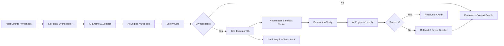

# TF3 · CDO-01 Capstone Brief

> Dành cho team **CDO-01** trong đề tài **TF3 - Self-Heal Engine**.  
> Team CDO-01 phối hợp với **AIO-04** và cạnh tranh solution với **CDO-02**.

---

## 1. Bức tranh tổng quan

Capstone W11-W12 là mô phỏng một consulting engagement thật: không còn lab có answer key, mà phải gặp “Client”, clarify brief, chốt scope, ký contract AI-CDO, build sản phẩm chạy được, demo và defend trước panel.

Trong task force TF3:

- **AIO-04**: own phần AI Engine, thiết kế engine, viết 3 contracts cho CDO consume, deploy skeleton endpoint, sau đó thay dần bằng logic thật.
- **CDO-01**: build platform/infra hosting và tích hợp AI Engine theo một góc nhìn riêng.
- **CDO-02**: build cùng đề, cùng dùng AI Engine, nhưng cạnh tranh trực tiếp với CDO-01 về execution quality, infra quality, integration, security, observability, test evidence và câu chuyện differentiation.

Điểm quan trọng: CDO-01 không chỉ “deploy được” là xong. Cần trả lời được câu: **infra của CDO-01 vượt trội CDO-02 ở đâu, vì sao thiết kế này hợp lý hơn cho Self-Heal Engine?**

---

## 2. Context dự án TF3 - Self-Heal Engine

### Client

Client là **VP Engineering của SaaS platform B2B**, vận hành:

- 200+ microservice trên Kubernetes.
- EKS multi-AZ, single region `us-east-1`.
- Peak traffic khoảng 8K RPS.
- Khoảng 120 enterprise tenant.
- Data layer khoảng 12TB live state, gồm RDS Aurora + DynamoDB.
- On-call rotation gồm 6 engineer, chia primary + secondary.

### Problem

Mỗi đêm on-call nhận 2-4 page. Khoảng 80% là known patterns lặp đi lặp lại:

- Pod `OOMKilled` → adjust memory limit.
- Service stuck → restart deployment.
- Queue backlog → scale worker.
- Cert expiring → rotate secret.

Vấn đề kinh doanh không chỉ là lỗi kỹ thuật. Vấn đề chính là **on-call burnout**: engineer bị đánh thức lúc 2h sáng chỉ để làm thao tác lặp lại như restart/scale/rotate. Client muốn giảm tải cho engineer bằng automation có kiểm soát.

### Client muốn gì

Build **Self-Heal Engine** theo pipeline:

```text
detect → match runbook → execute audited action → verify → escalate nếu fail
```

Nghĩa là hệ thống cần:

1. Nhận alert/anomaly.
2. Gọi AI Engine để detect và decide runbook/action.
3. Thực thi action trên sandbox Kubernetes cluster.
4. Ghi audit trail chống sửa/xóa.
5. Verify sau khi action.
6. Rollback hoặc escalate nếu thất bại.

---

## 3. Hard requirements phải nhớ

Các yêu cầu bắt buộc của TF3:

- Implement + test ít nhất **3 known patterns**.
- Design thêm ít nhất **2 patterns** ở mức paper playbook + diagram.
- Auto-resolve rate tối thiểu **60%** trên ít nhất **10 injected scenarios**.
- Có **scenario simulation ≥ 4 giờ**; không cần quan sát production thật 1 tuần.
- **Zero unsafe action** trong sandbox.
- Audit log tamper-evident, retention **≥90 ngày**.
- Có đủ 5 safety checkpoint:
  - dry-run
  - blast-radius check
  - verify post-action
  - auto rollback
  - circuit breaker
- Multi-tenant ít nhất **2 tenants** với RBAC isolation.
- Escalation message do AI generate, kèm context bundle đầy đủ.

Nếu dùng đúng 10 scenarios, target 60% nghĩa là phải tự động xử lý thành công ít nhất **6/10 scenarios**.

---

## 4. Out of scope - tránh scope creep

Không nên sa đà vào các phần sau:

- Không làm multi-cluster federation.
- Không auto-discover pattern mới; rule/pattern do team define explicit.
- Không làm cost-aware routing, đó là TF2.
- Không làm cross-service root cause chain analysis.
- Không cần production traffic, chỉ sandbox + synthetic workload.
- Không cần real PagerDuty/OpsGenie; Slack webhook hoặc mock pager là đủ.
- Không bắt buộc GitOps full integration; pre-state snapshot trong audit log đủ.
- Không làm predictive lens, đó là TF4.
- Không auto-retrain ML model.
- Không cần hash-chain crypto signing audit; S3 Object Lock đủ.
- Không cần mTLS internal endpoint; JWT bearer token đủ cho capstone.

Điểm nguy hiểm: đề tài tên “Self-Heal” rất dễ bị over-engineer thành platform production-grade. Capstone yêu cầu sản phẩm demo rõ, có safety, có audit, có evidence; không yêu cầu xây hệ thống production hoàn chỉnh.

---

## 5. Vai trò cụ thể của CDO-01

CDO-01 không own AI model. CDO-01 own **platform để AI Engine vận hành an toàn**.

CDO-01 cần build:

- Sandbox EKS cluster hoặc Kubernetes sandbox tương đương.
- RBAC setup cho engine/executor theo least privilege.
- Audit log infra, ưu tiên S3 Object Lock hoặc append-only storage.
- Observability stack: Prometheus/Grafana/CloudWatch/logs/traces tùy kiến trúc.
- Alert webhook → engine → action → verify → audit log queryable.
- CI/CD + IaC + deployment strategy.
- Multi-tenant isolation cho ít nhất 2 tenants.
- E2E test và scenario simulation.

CDO-01 phải show được:

- Infra chạy được.
- AI endpoint được gọi thật ở W12 integration.
- Action được execute an toàn.
- Audit log query được.
- Rollback/circuit breaker hoạt động.
- Có số liệu p99 latency, availability, error rate, cost, test result.

---

## 6. Gợi ý differentiation angle cho CDO-01

Để cạnh tranh với CDO-02, CDO-01 nên chọn một angle rõ ràng thay vì “em cũng deploy EKS + API Gateway”.

### Angle đề xuất: K8s-native audited workflow self-healing platform

Thông điệp pitch:

> CDO-01 không chỉ host AI Engine. CDO-01 build một self-heal control plane an toàn cho Kubernetes: mọi remediation đều đi qua dry-run, blast-radius check, idempotency lock, least-privilege executor, tamper-evident audit, verify và rollback.

### Vì sao angle này hợp TF3?

TF3 là bài toán Kubernetes self-heal. Client quan tâm nhất không phải AI “nghe hay”, mà là automation có làm hỏng cluster không. Vì vậy CDO-01 nên thắng ở các trục:

- Safety hơn: action nào cũng có guardrail.
- Audit tốt hơn: mọi decision/action/verify đều query được.
- Isolation rõ hơn: tenant/namespace/RBAC tách bạch.
- Demo convincing hơn: có injected scenarios, có success/failure/rollback evidence.
- Defend tốt hơn: mỗi action có ADR, trade-off, rollback plan.

### Kiến trúc gợi ý



### Component breakdown gợi ý

| Component | Vai trò | Gợi ý công nghệ |
|---|---|---|
| Alert source | Gửi incident/event vào hệ thống | Prometheus Alertmanager webhook hoặc custom webhook |
| Self-Heal Orchestrator | Điều phối detect/decide/execute/verify | FastAPI/NestJS service hoặc workflow engine nhẹ |
| AI Engine Client | Gọi endpoint của AIO-04 | HTTP client với retry, timeout, correlation_id |
| Safety Gate | Validate dry-run, blast radius, tenant, namespace, action allowlist | Policy code + JSON schema |
| K8s Executor | Thực thi restart/scale/patch/rotate | Kubernetes API + ServiceAccount least privilege |
| Idempotency Lock | Tránh execute lặp action cùng incident | DynamoDB conditional write hoặc Redis lock |
| Audit Storage | Ghi event bất biến | S3 Object Lock + Athena hoặc append-only DB |
| Observability | Metric/log/dashboard | Prometheus + Grafana + CloudWatch |
| Escalation | Gửi context bundle khi fail | Slack webhook/mock pager |

---

## 7. Known patterns nên chọn để demo

Nên chọn pattern dễ inject, dễ verify, ít rủi ro:

### Pattern 1: Service stuck → restart deployment

- Detect: probe fail, pod not ready, error rate cao.
- Action: `kubectl rollout restart deployment/<name>` hoặc patch annotation restart.
- Safety: chỉ namespace sandbox/tenant allowlist.
- Verify: pod ready trở lại, error rate giảm.
- Rollback: rollback deployment nếu restart làm regression.

### Pattern 2: Queue backlog → scale worker

- Detect: backlog vượt threshold.
- Action: scale deployment worker từ N lên N+k.
- Safety: max replicas, tenant quota, cooldown.
- Verify: backlog giảm trong window X phút.
- Rollback: scale về replica trước đó nếu error tăng.

### Pattern 3: Pod OOMKilled → adjust memory limit

- Detect: pod restart reason OOMKilled.
- Action: patch resource limit/request trong deployment sandbox.
- Safety: max memory cap, chỉ app demo, dry-run trước.
- Verify: restart count không tăng, pod stable.
- Rollback: restore previous deployment spec.

### Designed-only pattern 4: Cert expiring → rotate secret

- Design: detect cert expiry, create/rotate secret, restart consumer deployment.
- Không cần implement nếu thiếu thời gian.

### Designed-only pattern 5: ImagePullBackOff hoặc CrashLoopBackOff → rollback image

- Design: detect failed rollout, rollback về previous ReplicaSet/image.
- Rất hợp với kiến thức Argo Rollouts/GitOps đã học.

---

## 8. 3 contracts với AIO-04 cần soi kỹ

AI sẽ draft 3 contracts, nhưng CDO-01 phải review và push-back nếu khó build.

### 8.1 Telemetry Contract

Cần chốt rõ:

- CDO emit signals nào: alert event, pod status, logs, metrics, deploy history, tenant_id, namespace, service_name.
- Format JSON ra sao.
- Required fields và optional fields.
- Field time unit: `latency_ms` hay `latency_us`, timestamp ISO hay epoch.
- Data retention và PII/tenant isolation.
- SLA gửi telemetry: real-time hay batch.

### 8.2 AI API Contract

TF3 có các endpoint chính:

- `POST /v1/detect`
- `POST /v1/decide`
- `POST /v1/verify`
- optional `POST /v1/rollback`

Mandatory request fields:

- `idempotency_key`
- `dry_run_mode`
- `correlation_id`

CDO-01 cần yêu cầu contract ghi rõ:

- URL/path cố định.
- Request/response schema.
- Error codes: 400, 401, 429, 503.
- Timeout/retry policy.
- Response khi AI confidence thấp.
- Response khi action không nằm trong allowlist.
- Schema cho `action_plan`, `blast_radius`, `rollback_plan`, `verification_result`.

### 8.3 Deployment Contract

Cần chốt rõ:

- AI Engine deploy ở đâu, CDO gọi qua network nào.
- Secret/kubeconfig dùng thế nào.
- K8s ServiceAccount + RBAC permission cụ thể.
- Idempotency lock dùng DynamoDB hay Redis.
- Audit storage dùng S3 Object Lock hay append-only DB.
- Rollback ownership: AI trả plan, CDO executor thực thi, hay AI tự thực thi?
- Ai chịu trách nhiệm khi endpoint AI down.

---

## 9. Timeline hành động cho CDO-01

### W11 T2 - Discovery + debrief

Việc cần làm:

- Đọc kỹ TF3 learner file.
- Chuẩn bị 10-15 câu hỏi Client.
- Interview mentor-as-Client.
- Sau interview, viết debrief dạng “Em hiểu là…” để confirm lại scope.
- Chốt sơ bộ differentiation angle với team.

Câu hỏi nên hỏi Client:

1. Sandbox cluster dùng version K8s nào?
2. Namespace/tenant structure mong muốn ra sao?
3. 3 pattern nào có business priority cao nhất?
4. “Auto-resolved” được tính khi action success hay metric quay lại bình thường?
5. Blast radius tối đa là bao nhiêu pod/namespace/replica?
6. Circuit breaker trigger theo điều kiện nào?
7. Mỗi pattern được retry mấy lần trước khi escalate?
8. Audit log cần query theo fields nào?
9. SOC2 control cụ thể liên quan đến audit là gì?
10. Alert source ưu tiên là Alertmanager hay custom webhook?
11. Engine crash giữa action thì recovery thế nào?
12. Detect → action → verify latency budget là bao nhiêu?
13. Rollback theo snapshot, Git, hay per-pattern?
14. LLM có bắt buộc không hay rule-based/hybrid được chấp nhận?
15. Slack/mock pager message cần format gì?

### W11 T3-T4 - Design + contract review

Việc cần làm:

- Draft `01_requirements_analysis.md`.
- Draft `02_infra_design.md`, đặc biệt section differentiation angle.
- Viết ít nhất 2 ADR ban đầu.
- Review 3 contracts draft từ AIO-04.
- Ghi push-back rõ ràng: cái gì khó build, cái gì thiếu schema, cái gì rủi ro.

### W11 T5 - Approve + sign contracts

Việc cần làm:

- Co-design với AIO-04 buổi sáng.
- Chốt contract, không để schema mơ hồ.
- Finalize doc để mentor approve.
- Sau khi ký, coi 3 contracts là frozen.
- Nhận curveball #1 và ghi vào `curveball-responses.md`.

### W11 T6 - Base infra

Việc cần làm:

- Có base infra chạy được: VPC + cluster + observability.
- Có repo structure đúng template.
- Có deployment skeleton để gọi được AI skeleton endpoint.
- Có audit storage skeleton.
- Có standup notes.

### W12 T2 - Integrate + observability + curveball #2

Việc cần làm:

- Tích hợp AI endpoint thật/skeleton vào orchestrator.
- Có dashboard metric/log cơ bản.
- Bắt đầu tenant onboarding flow.
- Có CI/CD canary hoặc deployment strategy rõ.
- Respond curveball #2.

### W12 T3 - E2E integration

Việc cần làm:

- Chạy E2E: alert webhook → AI → action → verify → audit.
- Test ít nhất 1-2 pattern chạy end-to-end.
- Fix contract mismatch nếu còn.
- Chuẩn bị data cho `07_test_eval_report.md`.

### W12 T4 - Chaos + final evidence

Việc cần làm:

- Chạy scenario simulation ≥4h.
- Có ≥10 injected scenarios.
- Tính auto-resolve rate.
- Chạy load/SLO/security test tối thiểu.
- Document curveball #3.
- Dry-run pitch và individual defense.
- Final docs, final ADRs, final cost analysis, final test report.

### W12 T5 - Code freeze + judging

Việc cần làm:

- Tag git `final` trước giờ freeze.
- Chỉ sửa slides/script sau freeze.
- CDO-01 pitch 15 phút: demo + differentiation + evidence.
- Chuẩn bị individual defense: mỗi thành viên phải walk through được task mình claim Done.

---

## 10. Deliverables CDO-01 phải có

### W11 Pack #1

```text
capstone/tf-3/cdo-01/
├── docs/
│   ├── 01_requirements_analysis.md
│   ├── 02_infra_design.md
│   ├── 03_security_design.md
│   ├── 04_deployment_design.md
│   ├── 05_cost_analysis.md        # skeleton
│   └── 08_adrs.md                 # ≥3 ADRs
├── infra/                         # Terraform base
├── manifests/                     # K8s manifests nếu có
└── standup-notes.md
```

W11 target: base infra chạy được, VPC + cluster + observability, docs đủ để mentor tin rằng W12 build được.

### W12 Pack #2

```text
capstone/tf-3/cdo-01/
├── final-build/
├── docs/
│   ├── 01_requirements_analysis.md
│   ├── 02_infra_design.md
│   ├── 03_security_design.md
│   ├── 04_deployment_design.md
│   ├── 05_cost_analysis.md        # measured actual
│   ├── 07_test_eval_report.md     # SLO + load + chaos + isolation
│   └── 08_adrs.md                 # ≥5 ADRs
├── SLIDES.pdf
├── demo-video.mp4
├── curveball-responses.md
├── individual-pitches.md
└── retrospective.md
```

---

## 11. ADR nên viết sớm

Tối thiểu nên có các ADR sau:

1. **ADR-001 - Chọn K8s-native workflow/self-heal orchestrator thay vì simple script executor**.
2. **ADR-002 - Chọn S3 Object Lock cho audit tamper-evident thay vì chỉ CloudWatch Logs**.
3. **ADR-003 - Chọn namespace-per-tenant + RBAC isolation thay vì shared namespace**.
4. **ADR-004 - Chọn Prometheus Alertmanager/custom webhook làm alert source ban đầu**.
5. **ADR-005 - Chọn DynamoDB conditional write cho idempotency lock thay vì in-memory lock**.
6. **ADR-006 - Chọn runbook YAML/JSON schema thay vì hardcode action trong code**.
7. **ADR-007 - Chọn deployment strategy canary/rolling + rollback method cụ thể**.

Mỗi ADR phải có: Context, Decision, Consequence, Alternatives considered. Không viết kiểu “vì team thích”.

---

## 12. Jira và evidence cá nhân

Mỗi ngày mỗi thành viên cần:

- Pick task từ backlog.
- Move task theo flow: To Do → In Progress → In Review → Done.
- Comment progress/blocker ít nhất 1 lần/ngày.
- Khi close task, gắn evidence link: commit SHA, PR URL, doc commit hoặc screenshot.

Task nên từ 30 phút đến 1 ngày. Nếu task quá lớn thì split. Nếu task không có evidence, mentor có thể reject. Nếu bị hỏi individual defense mà không giải thích được commit/decision của mình, rủi ro bị cap tier.

Gợi ý task cá nhân cho bạn:

- Draft `01_requirements_analysis.md` phần infra NFR + out of scope.
- Viết ADR-001/ADR-002.
- Thiết kế RBAC ServiceAccount cho executor.
- Implement audit log schema + S3 Object Lock Terraform.
- Implement scenario Service stuck → restart deployment.
- Viết k6/load test hoặc script inject scenarios.
- Tạo Grafana dashboard cho self-heal metrics.
- Viết phần `07_test_eval_report.md` cho scenario simulation.

---

## 13. Metrics cần đo

### Product metrics

- Number of injected scenarios.
- Auto-resolve rate.
- Escalation rate.
- Rollback count.
- Unsafe action count = 0.
- Circuit breaker triggered count.

### Platform SLO

- API availability.
- P99 latency cho orchestrator/API.
- Error rate.
- Time from alert received → action executed.
- Time from action executed → verification complete.

### Security/compliance

- Audit record coverage: mỗi incident có detect/decide/execute/verify/escalate record không?
- Audit immutability: Object Lock/retention evidence.
- RBAC isolation: tenant A không thao tác tenant B.
- Namespace allowlist/denylist test.
- Secret handling evidence.

### Cost

- Cost theo service.
- Cost per tenant/month estimate.
- Cost của AI call nếu có số từ AIO-04.
- Cost của observability/audit storage.

---

## 14. Demo script gợi ý

Demo nên đi theo story này:

1. Show baseline: workload đang lỗi hoặc alert fire.
2. Webhook gửi incident vào orchestrator.
3. Orchestrator gọi `/v1/detect` và `/v1/decide`.
4. Show action plan + blast-radius check.
5. Chạy dry-run.
6. Execute action bằng K8s ServiceAccount least privilege.
7. Verify metric/pod state.
8. Query audit log.
9. Inject case fail để show escalation message với context bundle.
10. Show dashboard + test report + auto-resolve rate.

Thông điệp kết: **CDO-01 biến AI decision thành safe Kubernetes action có audit, rollback và tenant isolation.**

---

## 15. Risk cần để ý

| Risk | Dấu hiệu | Mitigation |
|---|---|---|
| Contract mơ hồ | AI response schema thiếu field action/rollback | Push-back T5 sáng, yêu cầu JSON schema rõ |
| Over-engineer | Chưa có E2E nhưng đang làm platform quá rộng | Chốt 3 pattern demo trước, phần còn lại designed-only |
| Unsafe action | Executor có quyền cluster-admin | ServiceAccount least privilege, namespace allowlist |
| Không chứng minh được audit | Chỉ log ra console | S3 Object Lock/append-only DB + query demo |
| Multi-tenant giả | Chỉ có tenant_id string, không có isolation test | Namespace + RBAC + negative test tenant A/B |
| Test thiếu số liệu | Demo chạy nhưng không có report | Chuẩn bị test script + bảng result từ W12 T3 |
| CDO-02 có story rõ hơn | CDO-01 chỉ nói “em dùng EKS” | Pitch theo angle safety/audit/control-plane |
| Individual defense fail | Thành viên không hiểu commit/task | Mỗi người own task thật + dry-run Q&A |

---

## 16. Checklist nhanh cho CDO-01

### Phải biết

- TF3 không phải AI research project; là self-heal sandbox platform có audit và safety.
- Contracts ký T5 W11 là interface frozen.
- CDO build được với mock/skeleton AI endpoint trước, nhưng W12 T3 phải gọi endpoint thật.
- Panel chấm differentiation giữa CDO-01 và CDO-02.
- Git history, Jira evidence, ADR, test report là một phần điểm, không phải phụ lục.

### Phải làm

- Chốt angle CDO-01 sớm.
- Review contract kỹ, đặc biệt schema và deployment permission.
- Build base infra trước, không đợi AI logic xong.
- Implement 3 patterns demo được.
- Ghi audit tamper-evident.
- Chạy ≥10 scenarios trong ≥4h.
- Có SLO/cost/security/multi-tenant isolation evidence.
- Chuẩn bị pitch + individual defense.

### Phải để ý

- Đừng dùng cluster-admin cho engine/executor.
- Đừng auto delete namespace/prod/IAM.
- Đừng để docs viết cuối cùng một lần.
- Đừng chỉ demo happy path; phải có fail → rollback/escalate.
- Đừng nói “AI quyết định” mà không show safety gate.
- Đừng để differentiation mờ nhạt so với CDO-02.

---

## 17. One-line strategy

> **CDO-01 nên thắng bằng câu chuyện: “Self-healing không nguy hiểm vì chúng tôi có K8s-native control plane với dry-run, blast-radius, idempotency, least-privilege RBAC, immutable audit, verify, rollback và tenant isolation.”**

